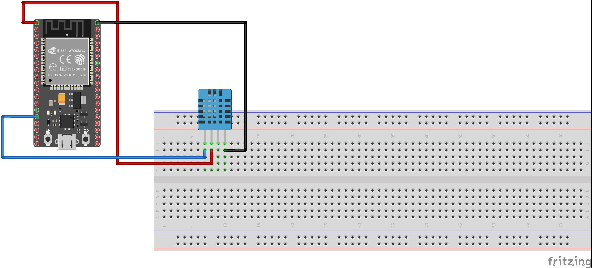
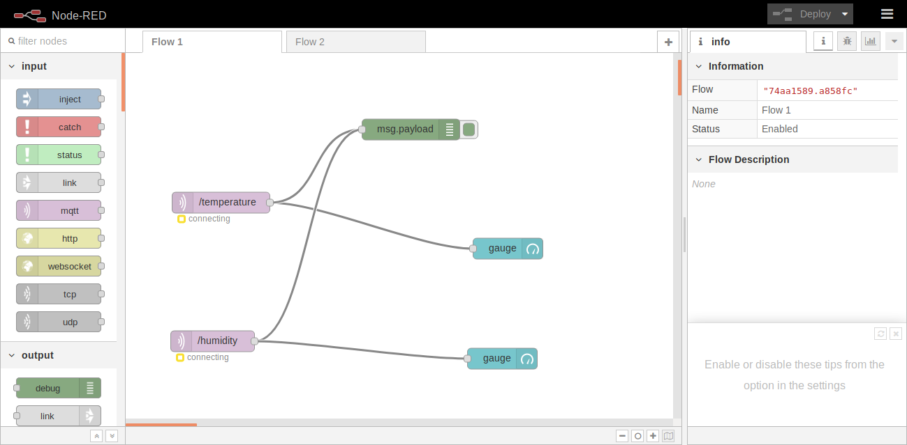
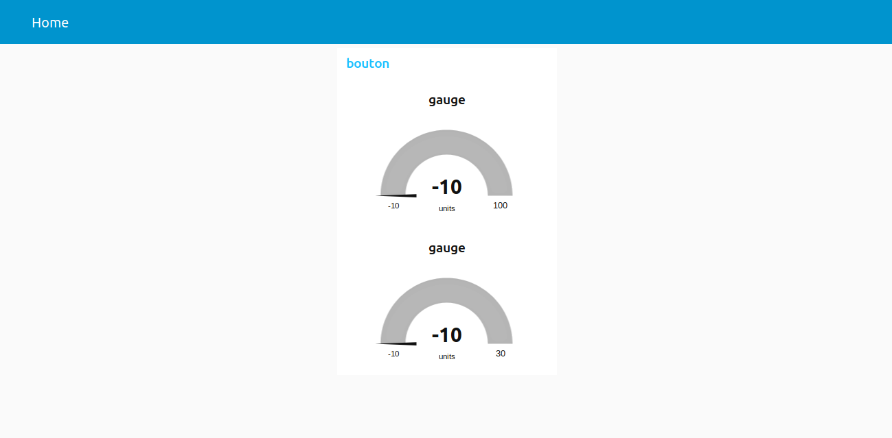

# capteur-d-hum-temp-wifi

Faire afficher les valeur du capteur de chaleur et d'humidité via l'interface node red par l'ESP32.

# Video

A venir ...

# Schema montage

# Node Red

# Blibliothèque

#include <WiFiServer.h>

#include <WiFiClient.h>

#include <WiFi.h>

#include <uTimerLib.h>

#include <Adafruit_MQTT.h>

#include <Adafruit_MQTT_Client.h>

#include <Adafruit_Sensor.h>

#include <DHT.h>

# Liste composants

+ 1 ESP32
+ 1 DHT11
+ 1 Bread Board
+ 3 cable male/femelle
+ cable micro usb

